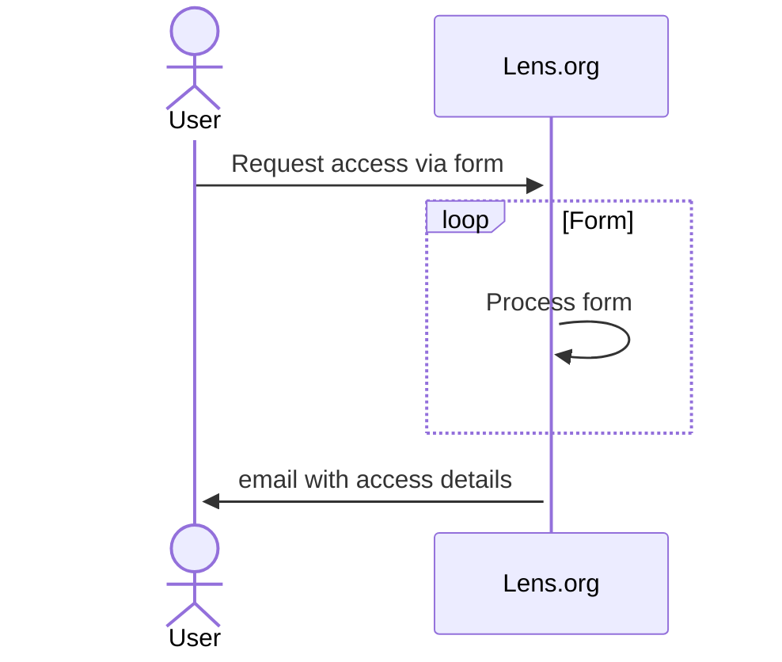

# APIs and Datasets for Scholarly Publications

Using [Lens.org](https://www.lens.org/) APIs and datasets.

## Accessing Data and API



1. Sign in using your KAUST email.
1. Select the type of API or bulk data you are interested in and click `Request Access` to access the online application form.
1. Apply by completing the online application. Make sure to provide accurate information about your use case, affiliation and organization.
1. Upon submission you will receive a confirmation email that your application is now being processed.
1. Your application is received by the Lens team and will be evaluated based on the use-case, commercial or non-commercial use, affiliation or organization size/type. We may contact you for additional information to help in the evaluation.
1. If your application is approved, you will receive another confirmation email that will include instructions on how to access your API token to obtain the data.

## Access Token

The first step to use the Lens.org API is to request token. See the below.


Once you have your token, you can start using the API.

## API Documentation

On the [Lens.org support](https://docs.api.lens.org/), there are two very important documents: [Requests](https://docs.api.lens.org/request.html), and [Reponse](https://docs.api.lens.org/response.html).

We will explore simple requests, and how to process the response. 

## Using the Notebook

The notebook can be used on [Visual Studio Code](https://code.visualstudio.com/) or [JupiterLab](https://jupyter.org/).

### Prerequisites

1. Clone the [GitHub repository](https://github.com/kaust-library/using_lens_org): https://github.com/kaust-library/using_lens_org
1. Create your virtual environment: `python -m venv venv`.
1. Activate your environment: `. .\venv\Scripts\activate`. (Windows platform) or `. venv/bin/activate` (Linux)
1. Install the required packages: `pip install -r requirements.txt`.

### VS Code

VScode has support for Jupyter notebook out-of-box. Just open the repository.

```
File -> open folder -> Folder where you cloned the repository
```

### Starting JupyterLab

After following the prerequisites above, you should be able to start `jupyter-lab`:

```
(venv) PS C:\Users\garcm0b\Work\lens_org> jupyter-lab
```

> Jupyter-lab will try to open a new tab/window of the browser, and for me, always failes. The solution is to click on the link below:

```
(venv) PS C:\Users\garcm0b\Work\lens_org> jupyter-lab
(...)
    To access the server, open this file in a browser:
        file:///C:/Users/garcm0b/AppData/Roaming/jupyter/runtime/jpserver-26340-open.html <----  Always fails
    Or copy and paste one of these URLs:
        http://localhost:8888/lab?token=258f8e8f9823683004ee32ce3d33e44673b92e714e6e3615 <---- Always works
```
