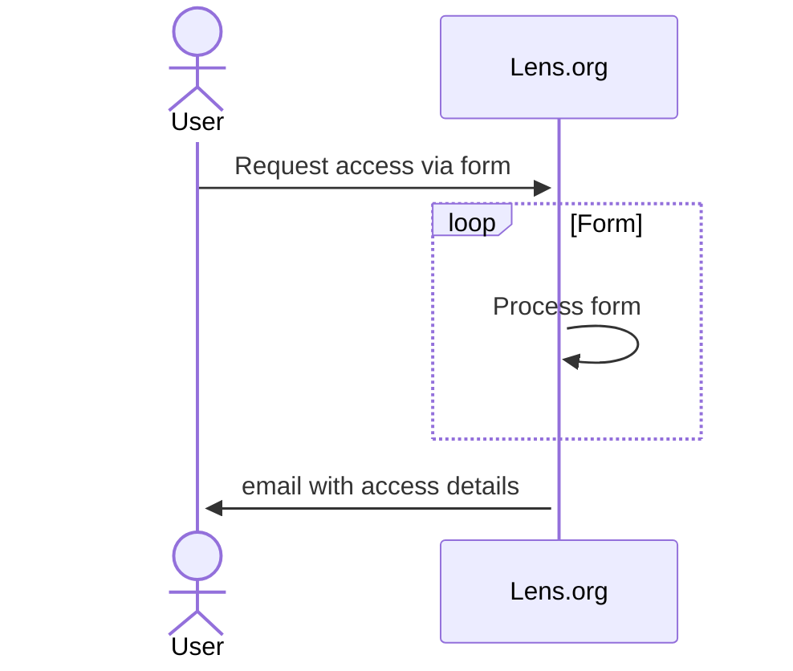

# APIs and Datasets for Scholarly Publications

Using [Lens.org](https://www.lens.org/) APIs and datasets.

## Accessing Data and API

1. Sign in using your KAUST email.
1. Select the type of API or bulk data you are interested in and click `Request Access` to access the online application form.

## Access Token

The first step to use the Lens.org API is to request token. See the below.

